# Subnet in Networking
## What is a Subnet?

A subnet, or subnetwork, is a segmented piece of a larger network. Subnets make networks more efficient by breaking them into smaller, more manageable pieces. This segmentation helps improve performance and security.

## Why Use Subnets?

1.  **Improved Performance**: By dividing a large network into smaller subnets, you reduce the amount of broadcast traffic, which can improve overall network performance.
2.  **Enhanced Security**: Subnets can isolate sensitive parts of a network, making it harder for unauthorized users to access restricted areas.
3.  **Simplified Management**: Smaller networks are easier to manage and troubleshoot.

## Key Concepts

### IP Address

An IP address is a unique identifier for a device on a network. It consists of two parts:

*   **Network Part**: Identifies the specific network.
*   **Host Part**: Identifies the specific device within that network.

### Subnet Mask

A subnet mask is used to divide an IP address into the network and host parts. It determines which portion of the IP address refers to the network and which part refers to the host.

### CIDR Notation

Classless Inter-Domain Routing (CIDR) notation is a way to specify IP addresses and their associated routing prefix. It is written as an IP address, followed by a slash, and then the number of bits in the network prefix (e.g., `192.168.1.0/24`).

### Subnetting

Subnetting is the process of dividing a network into smaller subnets. This involves:

1.  **Choosing a Subnet Mask**: Determines the size of each subnet.
2.  **Calculating Subnet Addresses**: Identifies the range of IP addresses within each subnet.

### Example

Consider the IP address `192.168.1.0` with a subnet mask of `255.255.255.0`:

*   **Network Part**: `192.168.1`
*   **Host Part**: `0`

If we change the subnet mask to `255.255.255.128`, we create two subnets:

*   **Subnet 1**: `192.168.1.0` to `192.168.1.127`
*   **Subnet 2**: `192.168.1.128` to `192.168.1.255`

## Diagrams

### Network and Subnet

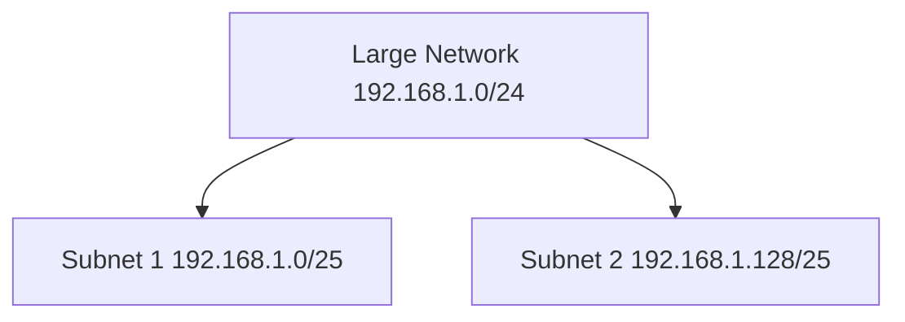

### IP Address Breakdown

```
IP Address: 192.168.1.10
Subnet Mask: 255.255.255.0

Network Part: 192.168.1
Host Part: 10
```

## Layer 2 (Data Link Layer) Details

The Data Link Layer (Layer 2) is crucial for local network communication. It ensures reliable transfer of data between two nodes connected on the same network segment. This layer handles the physical addressing, using MAC addresses, and provides error detection and correction mechanisms to ensure data integrity.

### Key Concepts

*   **MAC Address**: A Media Access Control (MAC) address is a unique 48-bit identifier assigned to a network interface card (NIC) by the manufacturer. It's used for identifying devices on a local network.
*   **Switch**: A network switch is a device that operates at Layer 2. It learns which MAC addresses are associated with each of its ports and forwards traffic only to the port where the destination MAC address is located. This reduces collisions and improves network efficiency compared to hubs.
*   **VLAN (Virtual LAN)**: VLANs allow you to segment a physical network into multiple logical networks. This means you can group devices into different VLANs regardless of their physical location. VLANs improve security, network management, and performance.

### Layer 2 operations in Subnets

Within a subnet, Layer 2 devices (switches) forward traffic based on MAC addresses. When a device in a subnet wants to communicate with another device in the same subnet, it uses the Address Resolution Protocol (ARP) to find the MAC address associated with the destination IP address. Once the MAC address is known, the switch forwards the traffic directly to the destination device.

## Layer 3 (Network Layer) Details

The Network Layer (Layer 3) is responsible for routing data packets between different networks. It uses IP addresses to determine the best path for a packet to travel from its source to its destination, potentially across multiple networks.

### Key Concepts

*   **Router**: A router is a device that operates at Layer 3. It maintains routing tables that contain information about different networks and the best path to reach them. When a router receives a packet, it examines the destination IP address and uses its routing table to determine the next hop for the packet.
*   **IP Address**: An Internet Protocol (IP) address is a logical address assigned to each device on a network. It's used for identifying devices across different networks. IP addresses come in two versions: IPv4 (32-bit) and IPv6 (128-bit).
*   **Routing Protocols**: Routers use routing protocols (e.g., OSPF, BGP) to exchange routing information with each other and dynamically update their routing tables.

### Layer 3 operations in Subnets

When a device in one subnet needs to communicate with a device in a different subnet, the traffic must be routed through a router. The source device sends the packet to its default gateway (the router), which then forwards the packet to the destination subnet based on the destination IP address. The router uses its routing table to determine the best path to the destination subnet.

## Interaction between Layer 2 and Layer 3 in Subnets

Layer 2 and Layer 3 work together to enable communication within and between subnets. Here’s how they interact:

1.  **Intra-subnet Communication**: When devices within the same subnet communicate, they use Layer 2 protocols (Ethernet, MAC addresses) for direct communication through switches.
2.  **Inter-subnet Communication**: When devices in different subnets communicate, they rely on Layer 3 protocols (IP addresses) and routers to forward traffic between subnets. The source device sends the packet to its default gateway (router), which then routes the packet to the destination subnet.

## Conclusion

Subnets are a fundamental building block of modern networks, enabling efficient network management, improved performance, and enhanced security. Understanding the roles of Layer 2 and Layer 3, and how they interact within a subnetted environment, is essential for any network administrator or engineer. By segmenting networks into smaller, more manageable pieces, organizations can optimize their network infrastructure and ensure reliable communication between devices.

---

## LAN Immobility

### What is LAN Immobility?

LAN immobility refers to the challenge of maintaining consistent network configurations and connectivity when devices are moved within a local area network (LAN). In traditional LAN setups, moving a device to a different physical location often requires reconfiguration of network settings, such as IP addresses and VLAN assignments.

### Challenges of LAN Immobility

1. **Manual Reconfiguration**: Moving a device to a new location typically requires manual reconfiguration of network settings, which can be time-consuming and prone to errors.
2. **Network Downtime**: During the reconfiguration process, the device may experience network downtime, disrupting productivity.
3. **Inconsistent Policies**: Ensuring consistent application of network policies (e.g., security, quality of service) across different locations can be challenging.

### Solutions to LAN Immobility

1. **Dynamic Host Configuration Protocol (DHCP)**: DHCP can automatically assign IP addresses to devices, reducing the need for manual reconfiguration.
2. **Virtual LANs (VLANs)**: VLANs can logically segment the network, allowing devices to maintain their network settings regardless of physical location.
3. **Software-Defined Networking (SDN)**: SDN enables centralized management of network configurations, allowing for dynamic adjustments as devices move within the network.

### Diagrams

#### Traditional LAN Setup

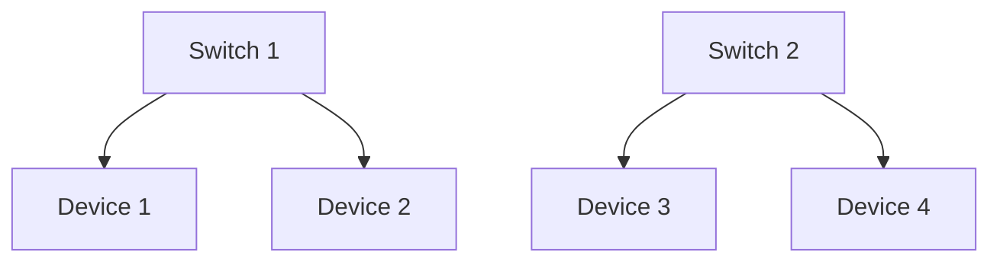

In a traditional LAN setup, moving Device 1 from Switch 1 to Switch 2 requires manual reconfiguration.

#### VLAN Setup

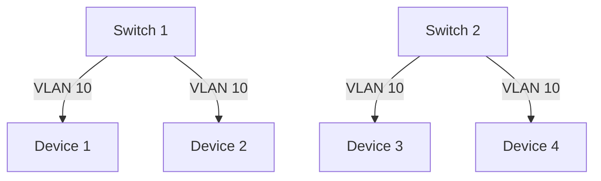

With VLANs, devices can maintain their network settings (e.g., VLAN 10) regardless of their physical location within the network.

### Conclusion

LAN immobility can pose significant challenges in maintaining consistent network configurations and connectivity. By leveraging technologies such as DHCP, VLANs, and SDN, organizations can overcome these challenges and ensure seamless network operations as devices move within the LAN.

---
## Introduction to VLANs

### What is a VLAN?

A Virtual Local Area Network (VLAN) is a technology that allows you to create separate, isolated networks within a single physical network. This means you can group devices together based on their function, department, or any other criteria, regardless of their physical location.

### Why Use VLANs?

1. **Improved Security**: VLANs can isolate sensitive data and devices from the rest of the network, reducing the risk of unauthorized access.
2. **Better Network Management**: VLANs make it easier to manage and troubleshoot networks by logically grouping devices.
3. **Enhanced Performance**: By segmenting the network, VLANs can reduce broadcast traffic and improve overall network performance.

### How VLANs Work

VLANs use switches to create virtual networks. Each VLAN is assigned a unique identifier, and devices within the same VLAN can communicate with each other as if they were on the same physical network. Traffic between different VLANs is typically managed by a router or a Layer 3 switch.

### Example

Consider a company with different departments such as HR, Finance, and IT. Using VLANs, you can create separate networks for each department:

* **VLAN 10**: HR Department
* **VLAN 20**: Finance Department
* **VLAN 30**: IT Department

This setup ensures that devices in the HR department can only communicate with other HR devices, and the same applies to Finance and IT.

### Diagrams

#### VLAN Setup

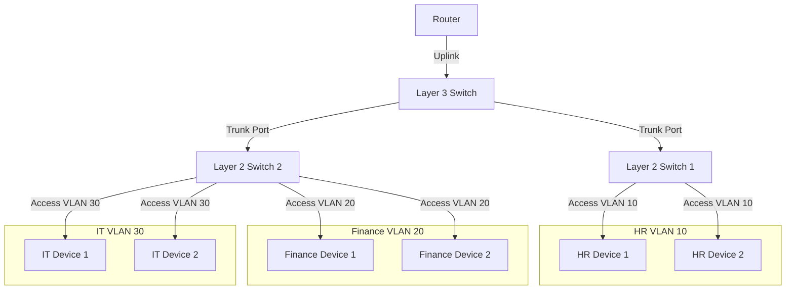

---
## Difference Between LAN and VLAN

### Comparison Table

| Feature               | LAN                              | VLAN                             |
|-----------------------|----------------------------------|----------------------------------|
| Scope                 | Limited to a small area          | Can span multiple locations      |
| Network Segmentation  | Physical                         | Logical                          |
| Broadcast Domain      | Single                           | Multiple                         |
| Security              | Physical measures                | Logical segmentation             |
| Flexibility           | Less flexible                    | Highly flexible                  |
| Management            | Simpler                          | More complex                     |

### Conclusion

While both LAN and VLAN are used to connect devices within a network, VLANs offer greater flexibility, security, and management capabilities by allowing logical segmentation of the network. This makes VLANs particularly useful in larger and more complex network environments.

---


### **Access vs. Trunk Ports in VLAN Networking**

#### **Access Ports**
- An **Access Port** is a switch port that belongs to **only one VLAN**.  
- It is used to connect **end devices** like computers, printers, and phones.  
- Any device plugged into an Access Port **only sees traffic from its assigned VLAN**.  

**Example:**  
- HR Device 1 (E) is in VLAN 10.  
- The switch port connecting to E is an **Access Port for VLAN 10**.  

**How it works:**  
- The switch **removes the VLAN tag** before sending data to the end device.  
- The device doesn’t need to know it’s in a VLAN—it just works.

#### **Trunk Ports**
- A **Trunk Port** is a switch port that carries **traffic for multiple VLANs**.  
- Used to connect **switches to other switches or to Layer 3 (L3) switches/routers**.  
- **VLAN tagging is used** to keep VLANs separated when they travel between switches.  

**Example:**  
- The connection between an L2 switch and an L3 switch uses a Trunk Port.  
- This port carries **VLAN 10, VLAN 20, and VLAN 30 traffic together**.  

**How it works:**  
- The switch **adds VLAN tags** to the traffic before sending it to another switch.  
- The receiving switch **reads the VLAN tag** and sends it to the correct VLAN.  

#### **Access vs. Trunk Comparison Table**
| Feature  | Access Port | Trunk Port |
|----------|------------|------------|
| **Purpose**  | Connects end devices (PCs, printers, etc.) | Connects switches or L3 switch/router |
| **VLAN Membership** | Only **one VLAN** | **Multiple VLANs** |
| **VLAN Tagging** | No tagging (switch removes VLAN tag) | Tagged with VLAN IDs |
| **Example Connection** | PC → Switch | Switch → Switch or Switch → L3 Switch |
0
#### **Simple Diagram**
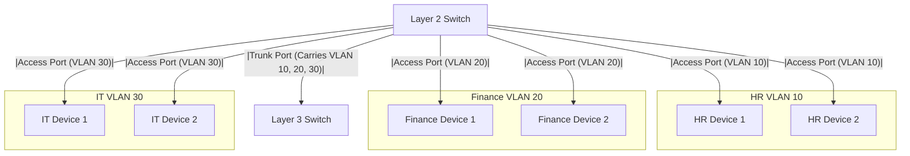

An **Access Port** connects end devices to a single VLAN, while a **Trunk Port** carries multiple VLANs between switches.

---

Here’s a **complete explanation** of **802.1Q VLAN Header** with **fixed Mermaid syntax** in **Markdown format** for direct use in GitHub or any documentation.  

---

# 802.1Q VLAN Header  

## **Overview**  
The **IEEE 802.1Q standard** defines VLAN tagging on **Ethernet frames**, allowing network switches to separate traffic into different VLANs.

### **Why VLAN Tagging?**  
- **Access Ports**: Send and receive **untagged** frames (only one VLAN).  
- **Trunk Ports**: Carry **multiple VLANs** using **802.1Q tags** between switches.  
- **Inter-VLAN Communication**: Layer 3 devices use **VLAN IDs** to route traffic between VLANs.

---

## **Ethernet Frame Formats**  

### **Standard Ethernet Frame (No VLAN Tag)**  

- This is a **normal Ethernet frame** without VLAN tagging.  
- It contains only the **MAC addresses, Type, Payload, and CRC**.

---

### **802.1Q VLAN Tagged Ethernet Frame**  

- **TPID `0x8100`** → Marks this as a **VLAN-tagged frame**.  
- **PCP (Priority Code Point)** → Used for **QoS (0-7 priority levels)**.  
- **DEI (Drop Eligible Indicator)** → Marks packets **eligible for dropping** in congestion.  
- **VLAN ID (12 bits)** → Identifies VLAN number (**1-4094**).  

---

## **Frame Format Comparison**
### **Without VLAN Tag (Regular Ethernet Frame)**
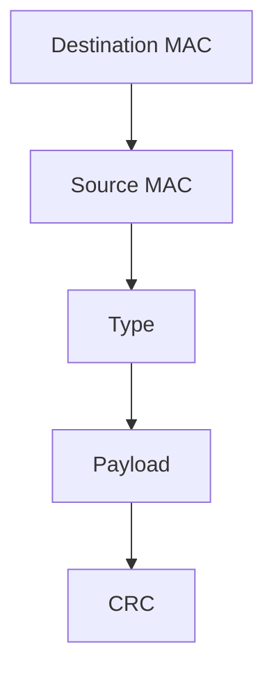
- Used in **access ports**, where VLAN tagging is not needed.

### **With VLAN Tag (802.1Q Tagged Frame)**
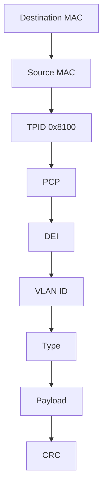
- Used in **trunk ports** to carry **multiple VLANs**.

---

## **Access vs. Trunk Ports**
### **Access Port (Untagged VLAN)**
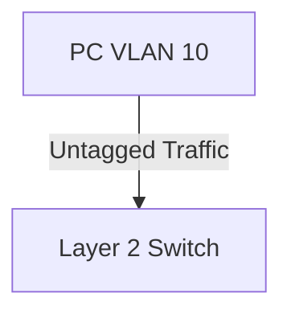
- The **switch removes VLAN tags** before sending to end devices.  
- End devices **do not need VLAN configuration**.  

### **Trunk Port (Tagged VLANs)**
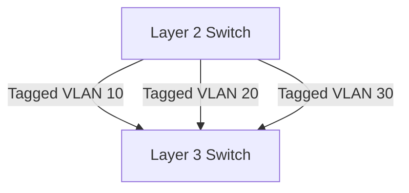
- A **single trunk port** carries **multiple VLANs** between switches.

---

## **Example: VLAN 10 Tagged Frame**
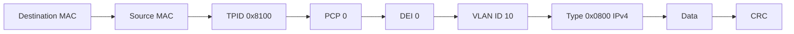
- **VLAN ID = 10** → This frame belongs to VLAN 10.  
- **Type `0x0800`** → Identifies **IPv4 traffic**.  

---

## **How VLAN Tagging Works**
### **Step 1: PC Sends an Untagged Frame**
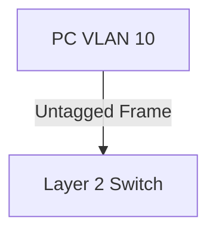
- The **PC is unaware of VLANs**.  
- The **switch assigns the frame to VLAN 10**.

### **Step 2: Switch Tags Frame for Trunk Port**
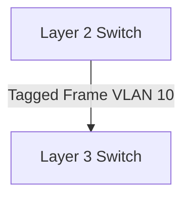
- When forwarding to another **switch over a trunk port**, **802.1Q tagging is added**.

### **Step 3: Switch Forwards to Destination**
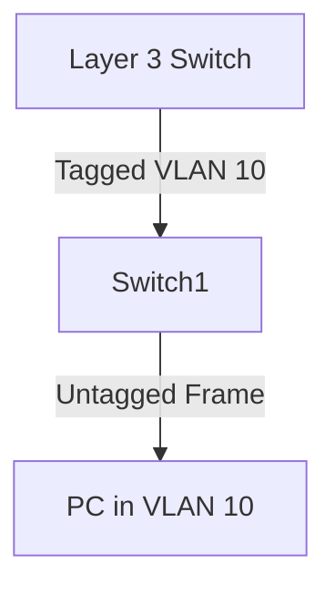
- The **receiving switch removes the VLAN tag** before delivering the frame to the PC.

---

## **Key Takeaways**
- **Access Ports**: Handle **untagged** frames and assign a VLAN.  
- **Trunk Ports**: Carry **tagged** VLAN frames for multiple VLANs.  
- **VLAN ID**: 12-bit field allows VLANs **1-4094**.  
- **TPID `0x8100`**: Marks a frame as **VLAN-tagged**.  
- **Inter-VLAN Routing**: Requires a **Layer 3 switch or router** to enable communication between VLANs.

---

### **VLAN Tagging Rules in 802.1Q**  

VLAN tagging follows **specific rules** to ensure that network traffic is correctly segmented and routed. These rules **govern how access ports, trunk ports, and VLAN-aware devices handle traffic.**  

---

## **1️⃣ Access Ports - Untagged Traffic**
### **Rule:**  
- Access ports **send and receive untagged frames**.  
- The switch **assigns** all frames received on an access port to a **single VLAN**.  
- When sending traffic to end devices, the switch **removes the VLAN tag**.

### **Example:**  
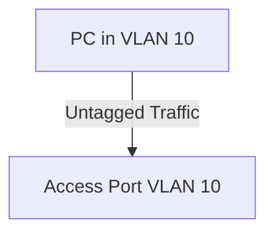
- The **PC does not need VLAN configuration**.
- The **switch assigns traffic to VLAN 10** internally.

---

## **2️⃣ Trunk Ports - Tagged Traffic**
### **Rule:**  
- Trunk ports **carry multiple VLANs** using **802.1Q VLAN tags**.  
- **Each frame is tagged** with a VLAN ID to differentiate VLAN traffic.  
- **Only VLANs explicitly allowed on the trunk** will be forwarded.  

### **Example:**  
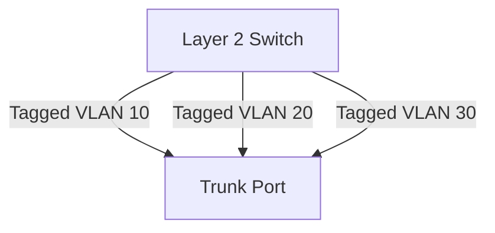
- A **single trunk link** carries **multiple VLANs** between switches.  
- The **VLAN tag helps route traffic to the correct VLAN** on the destination switch.

---

## **3️⃣ Native VLAN - Untagged Traffic on Trunk**
### **Rule:**  
- **A trunk port can have a "Native VLAN"** that carries untagged traffic.  
- Frames from the **Native VLAN are NOT tagged** when sent over the trunk.  
- Any **untagged frame received on a trunk is assigned to the Native VLAN**.

### **Example:**  
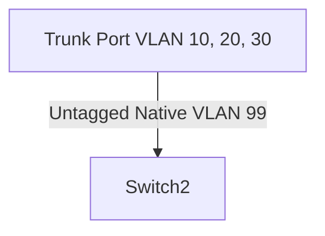
- The **default Native VLAN is VLAN 1**, but **best practice is to change it** (e.g., VLAN 99).  
- If **no VLAN tag is present**, the frame is **treated as Native VLAN traffic**.

---

## **4️⃣ VLAN Allowed List on Trunks**
### **Rule:**  
- A trunk port does **not forward all VLANs by default**.  
- **Administrators must specify** which VLANs are **allowed** on the trunk.  
- If a VLAN is **not in the allowed list**, its traffic is **dropped**.

### **Example:**  
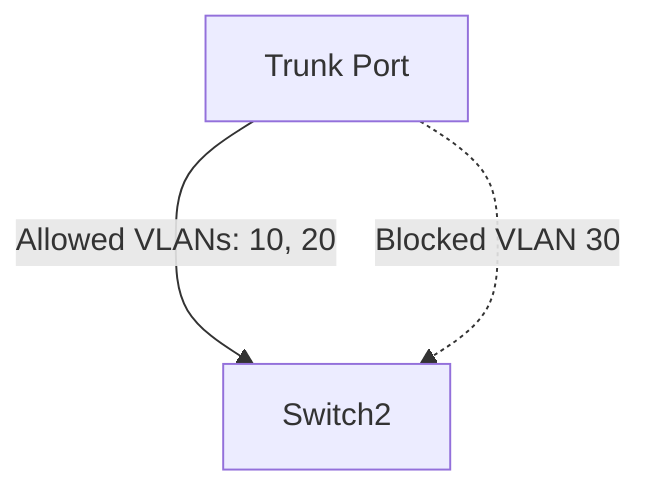
- **VLAN 30 is blocked** because it is **not in the allowed list**.  
- Only **VLAN 10 and VLAN 20** traffic passes.

---

## **5️⃣ VLAN Pruning**
### **Rule:**  
- VLAN pruning **prevents unnecessary VLAN traffic** on a trunk.  
- If **no devices are using a VLAN on a switch**, that VLAN's traffic is **not forwarded** to the switch.

### **Example:**  
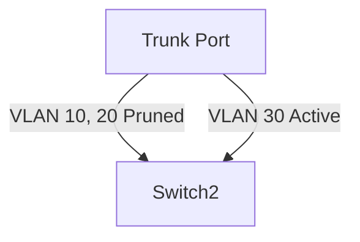
- VLANs **10 and 20 are pruned** because there are **no devices in those VLANs** on the other switch.  
- **Only VLAN 30 traffic is forwarded**.

---

## **6️⃣ Inter-VLAN Routing**
### **Rule:**  
- **VLANs cannot communicate with each other directly.**  
- **A Layer 3 device (Router or L3 Switch) is needed** to route traffic between VLANs.  
- Each VLAN must be assigned a **virtual interface (SVI) or subinterface** for routing.

### **Example:**  
```mermaid
graph TD;
    VLAN10[HR VLAN 10] --> |Needs Routing| L3Switch[Layer 3 Switch]
    VLAN20[Finance VLAN 20] --> |Needs Routing| L3Switch
```
- **A Layer 3 switch or router** is required to enable communication between VLANs.  

---

## **7️⃣ VLAN 1 - Default VLAN Best Practices**
### **Rule:**  
- VLAN 1 is the **default VLAN** for all ports and management traffic.  
- **Best Practice:**  
  - **Do not use VLAN 1 for data traffic.**  
  - **Change the Native VLAN to another VLAN (e.g., VLAN 99).**  
  - **Restrict VLAN 1 on trunk links.**  

### **Example:**  
```mermaid
graph TD;
    Switch1[Default VLAN 1] -..-> |Security Risk| Switch2
    Switch1 --> |Change Native VLAN to 99| Switch2
```
- VLAN 1 **should not be used** for normal traffic due to **security concerns**.

---

## **8️⃣ VLAN ID Ranges**
### **Rule:**  
- **VLANs are identified by a 12-bit VLAN ID (1-4094)**.  
- **Reserved VLANs:**
  - **VLAN 0** → Reserved (cannot be used).
  - **VLAN 1** → Default VLAN (avoid using for security reasons).
  - **VLAN 1002-1005** → Reserved for legacy Token Ring/FDDI.
  - **VLAN 4095** → Reserved (cannot be used).

### **VLAN ID Ranges**
| VLAN Range | Usage |
|------------|-------------------------|
| **1** | Default VLAN (Avoid using) |
| **2-1001** | Standard VLANs |
| **1002-1005** | Reserved for legacy networks |
| **1006-4094** | Extended VLANs (Requires VTP v3) |

---

## **Key VLAN Tagging Rules Summary**
| Rule | Description |
|------|-------------|
| **Access Ports** | Send/receive **untagged** traffic, assigned to one VLAN |
| **Trunk Ports** | Carry **multiple VLANs**, tagging each frame |
| **Native VLAN** | Frames **without a VLAN tag** are assigned to Native VLAN |
| **Allowed VLANs on Trunks** | VLANs must be **explicitly allowed** to pass through a trunk |
| **VLAN Pruning** | **Unused VLANs are not forwarded** across trunks |
| **Inter-VLAN Routing** | VLANs **need a Layer 3 device** to communicate |
| **VLAN 1 Best Practices** | **Avoid using VLAN 1** for security reasons |
| **VLAN ID Range** | **1-4094** (Standard: 1-1001, Extended: 1006-4094) |

---

## Benefits of VLANs

### Network Segmentation

VLANs allow for logical segmentation of a network, which can provide several benefits:

1. **Improved Security**: By segmenting the network into different VLANs, sensitive data and devices can be isolated from the rest of the network. This reduces the risk of unauthorized access and potential security breaches.
2. **Enhanced Performance**: VLANs help reduce broadcast traffic by limiting it to specific segments of the network. This can improve overall network performance by reducing unnecessary traffic.
3. **Simplified Management**: VLANs make it easier to manage and troubleshoot networks by logically grouping devices based on function, department, or other criteria. This logical grouping can simplify network administration and policy enforcement.

### Resolving Network Thrashing

Network thrashing occurs when there is excessive broadcast traffic, leading to network congestion and performance degradation. VLANs can help resolve network thrashing by:

1. **Reducing Broadcast Domains**: By creating multiple VLANs, the size of each broadcast domain is reduced. This limits the scope of broadcast traffic and prevents it from overwhelming the entire network.
2. **Isolating Traffic**: VLANs isolate traffic within specific segments, ensuring that broadcast traffic in one VLAN does not affect other VLANs. This isolation helps maintain network stability and performance.

### Reducing Broadcast Domains

Broadcast domains are areas of the network where broadcast traffic is propagated. VLANs help reduce the size of broadcast domains, which can provide several benefits:

1. **Improved Network Efficiency**: Smaller broadcast domains mean that broadcast traffic is limited to specific segments, reducing the overall load on the network.
2. **Enhanced Security**: By limiting broadcast traffic to specific VLANs, sensitive information is less likely to be exposed to unauthorized devices.
3. **Better Performance**: Reducing the size of broadcast domains helps minimize network congestion and improves the performance of the network.

### Mobility

VLANs provide greater flexibility and mobility within a network:

1. **Consistent Network Configuration**: Devices can maintain their network settings (e.g., IP addresses, VLAN assignments) regardless of their physical location within the network. This consistency simplifies network management and reduces the need for manual reconfiguration.
2. **Seamless Device Movement**: With VLANs, devices can be moved within the network without requiring changes to their network configuration. This mobility is particularly useful in dynamic environments where devices frequently change locations.
3. **Centralized Management**: VLANs enable centralized management of network configurations, allowing for dynamic adjustments as devices move within the network. This centralized approach simplifies network administration and ensures consistent policy enforcement.

### Conclusion

VLANs offer numerous benefits, including improved security, enhanced performance, simplified management, and greater network flexibility. By logically segmenting the network, VLANs help reduce broadcast domains, resolve network thrashing, and provide seamless mobility for devices. These advantages make VLANs an essential tool for modern network design and management.

